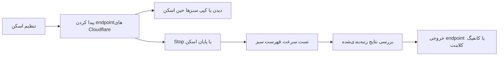

<p align="center">
  
</p>

<h1 align="center">KF Scanner</h1>

<p align="center">
  <strong>پیدا کردن، اعتبارسنجی، رتبه‌بندی و خروجی گرفتن از endpointهای پایدار Cloudflare</strong><br>
  یک موتور اسکن؛ سه تجربه متمرکز برای دسکتاپ، اندروید و ترمینال.
</p>

<p align="center">
  <a href="README.md">English</a> ·
  <a href="https://github.com/K_F_/KFScanner/releases/latest">دانلود</a> ·
  <a href="https://github.com/K_F_/KFScanner/issues">گزارش مشکل</a>
</p>

<p align="center">
  <a href="https://github.com/K_F_/KFScanner/stargazers"></a>
  <a href="https://github.com/K_F_/KFScanner/releases"></a>
  <a href="https://github.com/K_F_/KFScanner/forks"></a>
  <a href="https://github.com/K_F_/KFScanner/releases/latest"></a>
  <a href="LICENSE"></a>
</p>

---

KF Scanner یک اسکنر چندسکویی برای endpointهای Cloudflare است که برای شبکه‌های ناپایدار، فیلترشده یا پرتأخیر طراحی شده. ابزار ابتدا edgeهای Cloudflare را سریع بررسی می‌کند، سپس می‌تواند بهترین کاندیداها را با هسته داخلی Xray و کانفیگ واقعی شما end-to-end آزمایش کند و در پایان خروجی آماده استفاده در کلاینت‌ها بسازد.

نسخه **1.0.0** رابط بازطراحی‌شده **Signal Desk** را به GUI دسکتاپ و اپ اندروید می‌آورد: فضای جداگانه Scan، Results و Export، کپی زنده نتایج، تست سرعت بعد از Stop، اسکن همسایه اختیاری و تشخیص مقاوم‌تر ISP.

## چرا کاربردی است؟

| قابلیت | نتیجه |
|---|---|
| **اعتبارسنجی دومرحله‌ای** | بررسی سریع دسترسی Cloudflare و سپس تست اختیاری end-to-end با Xray |
| **نتایج زنده** | جست‌وجو، مرتب‌سازی، مشاهده و کپی endpointهای سالم حین ادامه اسکن |
| **تست سرعت بعد از Stop** | متوقف کردن discovery و تست همان فهرست سبزی که تا آن لحظه پیدا شده |
| **اسکن امن همسایه‌ها** | بررسی IPهای نزدیک فقط وقتی خودتان گزینه را فعال کرده باشید |
| **پروب آگاه از کانفیگ** | استخراج SNI، host، path، transport، TLS و port از VLESS، Trojan یا VMess |
| **خروجی قابل‌حمل** | endpoint خام، share URL بازنویسی‌شده، subscription، JSON مخصوص Sing-box و YAML مخصوص Clash |
| **تشخیص مقاوم ISP** | ادغام Cloudflare، IPWhois و IPinfo با fallback مبتنی بر DNS سرویس Team Cymru |

## انتخاب رابط

| رابط | پلتفرم‌ها | مناسب برای |
|---|---|---|
| **GUI دسکتاپ** | Windows، Linux، macOS | تجربه کامل Signal Desk، session پایدار، فیلتر زنده، تست سرعت و export |
| **اپ اندروید** | Android 7.0+ | همان روند Scan / Results / Export با کنترل‌های native و Material 3 |
| **CLI / TUI** | Windows، Linux، macOS، Termux | کار با کیبورد، مصرف کم و اجرا روی سیستم‌های remote |

## روند Signal Desk



در GUI دسکتاپ و اندروید هر مسئولیت فضای مستقل خودش را دارد:

- **Scan** — انتخاب منبع، پورت‌ها، worker، timeout، الزام WebSocket، URL کانفیگ و اسکن همسایه اختیاری.
- **Results** — مشاهده پیشرفت، فیلتر و مرتب‌سازی، کپی تمام سبزها یا ۲۰ نتیجه برتر در هر زمان و اجرای تست سرعت بعد از Stop.
- **Export** — کپی endpointهای خام یا ساخت کانفیگ‌های آماده کلاینت بعد از اعتبارسنجی.

## امکانات اصلی

### Discovery و رتبه‌بندی

- نمونه‌گیری تصادفی وزن‌دار از محدوده‌های IPv4 داخلی Cloudflare.
- ورودی فایل در دسکتاپ و CLI با پشتیبانی از IP، CSV و CIDR.
- پروب چندپورت با worker، timeout و بررسی WebSocket قابل تنظیم.
- نمایش زنده سلامت، latency، loss، throughput، colo، port و status.
- اسکن همسایه در GUI و CLI کاملاً اختیاری و به‌صورت پیش‌فرض **خاموش** است.
- Stop نتایجی را که تا همان لحظه پیدا شده‌اند حفظ می‌کند.

### اعتبارسنجی و تست سرعت

- لینک‌های پشتیبانی‌شده: `vless://`، `trojan://` و `vmess://`.
- پارس تنظیمات TCP، WebSocket، gRPC و XHTTP/SplitHTTP.
- اعتبارسنجی با Xray داخلی و کانفیگ واقعی پروکسی.
- اندازه‌گیری سرعت دانلود و TTFB و در صورت فعال بودن، تست upload.
- دکمه مستقل تست سرعت برای تمام نتایج سالم فعلی بعد از پایان discovery.

### Copy و Export

- کپی یک endpoint، همه سبزها یا ۲۰ نتیجه برتر بدون انتظار برای پایان اسکن.
- کپی endpointهای معتبر به‌شکل `IP:port`.
- بازنویسی share URL اصلی برای هر endpoint موفق.
- ساخت Base64 subscription، فایل Sing-box JSON و Clash YAML.
- جداسازی کامل Results و Export تا خروجی گرفتن مزاحم بررسی نتایج نشود.

## دانلود نسخه 1.0.0

فایل مناسب سیستم خود را از [GitHub Releases](https://github.com/K_F_/KFScanner/releases/latest) دریافت کنید. workflow نسخه `v1.0.0` همه رابط‌ها را با هم می‌سازد و فایل `SHA256SUMS.txt` را نیز منتشر می‌کند.

### GUI دسکتاپ

| پلتفرم | فایل Release |
|---|---|
| Windows x64 | `KFScanner-1.0.0-gui-windows-amd64.zip` |
| Linux x64 | `KFScanner-1.0.0-gui-linux-amd64.tar.gz` |
| macOS Intel | `KFScanner-1.0.0-gui-macos-intel.zip` |
| macOS Apple Silicon | `KFScanner-1.0.0-gui-macos-apple-silicon.zip` |

فایل اجرایی Windows و اپ Android از تصویر شفاف [`logo/logo.png`](logo/logo.png) استفاده می‌کنند.

### CLI / TUI

| پلتفرم | فایل Release |
|---|---|
| Windows x64 | `KFScanner-1.0.0-cli-windows-amd64.exe` |
| Windows ARM64 | `KFScanner-1.0.0-cli-windows-arm64.exe` |
| Linux x64 | `KFScanner-1.0.0-cli-linux-amd64` |
| Linux ARM64 / Termux | `KFScanner-1.0.0-cli-linux-arm64` |
| macOS Intel | `KFScanner-1.0.0-cli-macos-intel` |
| macOS Apple Silicon | `KFScanner-1.0.0-cli-macos-apple-silicon` |

در Linux و macOS بعد از دانلود، فایل CLI را executable کنید:

```bash
chmod +x KFScanner-1.0.0-cli-*
./KFScanner-1.0.0-cli-linux-amd64
```

### اندروید

| فایل Release | دستگاه |
|---|---|
| `KFScanner-1.0.0-android-universal.apk` | نسخه پیشنهادی برای sideload روی همه ABIهای پشتیبانی‌شده |
| `KFScanner-1.0.0-android-arm64-v8a.apk` | بیشتر گوشی‌های ۶۴ بیتی امروزی |
| `KFScanner-1.0.0-android-armeabi-v7a.apk` | دستگاه‌های قدیمی ۳۲ بیتی ARM |

حداقل نسخه اندروید API 24 است. هنگام sideload ممکن است لازم باشد اجازه «Install unknown apps» را برای برنامه‌ای که APK را باز می‌کند فعال کنید.

## شروع سریع

### دسکتاپ یا اندروید

1. وارد **Scan** شوید و برای اولین اجرا تنظیمات پیش‌فرض را نگه دارید.
2. اگر پروب وابسته به کانفیگ و خروجی کلاینت می‌خواهید، یک URL از نوع VLESS، Trojan یا VMess وارد کنید.
3. **Neighbor scan** را فقط وقتی فعال کنید که جست‌وجوی گسترده‌تر می‌خواهید.
4. discovery را شروع کنید و هر زمان خواستید به **Results** بروید؛ اسکن در پس‌زمینه ادامه دارد.
5. در هر لحظه از **Copy green** یا **Copy top 20** استفاده کنید.
6. وقتی فهرست کافی شد Stop بزنید و سپس **Speed test green results** را اجرا کنید.
7. از تب **Export** endpoint خام را کپی یا کانفیگ کلاینت تولید کنید.

### CLI / TUI

```bash
kfscanner
kfscanner --version
```

با کلیدهای جهت‌دار یا `h` / `j` / `k` / `l` حرکت کنید، با `Enter` تأیید کنید، با `Esc` برگردید و اسکن فعال را با `q` متوقف کنید. TUI آخرین تنظیمات اسکن را ذخیره می‌کند و از **Retry Last Scan** در دسترس قرار می‌دهد.

برای حالت فایل، `ips.txt` را کنار executable یا در working directory قرار دهید. IPv4 ساده، ستون اول CSV و CIDR پذیرفته می‌شوند؛ خطوط خالی و خطوطی که با `#` شروع شوند نادیده گرفته می‌شوند.

### Termux

روی گوشی‌های امروزی از فایل Linux ARM64 استفاده کنید:

```bash
pkg update
pkg install curl -y
curl -fL -o "$PREFIX/bin/kfscanner" \
  https://github.com/K_F_/KFScanner/releases/download/v1.0.0/KFScanner-1.0.0-cli-linux-arm64
chmod +x "$PREFIX/bin/kfscanner"
kfscanner
```

اگر کنترل لمسی، کلیپ‌بورد سیستم و چیدمان کامل Signal Desk را ترجیح می‌دهید، اپ native اندروید انتخاب بهتری است.

## ساخت از سورس

### پیش‌نیازها

- Go **1.26.1** یا نسخه ثبت‌شده در [`go.mod`](go.mod)
- Wails **2.11.0** و dependencyهای native webview برای GUI دسکتاپ
- JDK **17**، Android SDK **36** و Android Build Tools **36.0.0** برای اندروید
- ابزارهای `gomobile` و `gobind` برای بازسازی bridge اندروید

### تست و ساخت CLI

```bash
go test -short ./...
go vet ./...
go build -trimpath -o kfscanner ./cmd/kfscanner
```

در Windows می‌توانید مجموعه versioned همه CLIها را بسازید:

```powershell
./build.ps1 -Version 1.0.0
```

### ساخت GUI دسکتاپ

Wails را نصب و از پوشه `desktop` build بگیرید:

```powershell
go install github.com/wailsapp/wails/v2/cmd/wails@v2.11.0
cd desktop
./build_gui.ps1 -Version 1.0.0
```

Linux به development packageهای GTK 3 و WebKitGTK 4.1 نیاز دارد. macOS نیز باید با toolchain بومی Xcode ساخته شود. GitHub Actions هر GUI را روی سیستم‌عامل مقصد build می‌کند.

### ساخت اندروید

```bash
# Linux / macOS
./android/build_go_mobile.sh
cd android
./gradlew testDebugUnitTest lintRelease assembleRelease
```

```powershell
# Windows
./android/build_go_mobile.bat
cd android
./gradlew.bat testDebugUnitTest lintRelease assembleRelease
```

برای امضای APK در GitHub این secretها استفاده می‌شوند:

- `ANDROID_KEYSTORE_BASE64`
- `ANDROID_KEYSTORE_PASSWORD`
- `ANDROID_KEY_ALIAS`
- `ANDROID_KEY_PASSWORD`

اگر secretها وجود نداشته باشند، CI برای artifact آزمایشی یک کلید موقت می‌سازد. چنین فایلی نمی‌تواند نسخه‌ای را که با کلید production امضا شده update کند.

## اتوماسیون Release

build هر پلتفرم workflow مستقل دارد و در پایان همه در یک release ترکیب می‌شوند:

| Workflow | مسئولیت |
|---|---|
| [`ci.yml`](.github/workflows/ci.yml) | build، vet، test، race test و lint چندسکویی Go |
| [`build-cli.yml`](.github/workflows/build-cli.yml) | شش خروجی versioned برای CLI |
| [`build-gui.yml`](.github/workflows/build-gui.yml) | بسته native برای Windows، Linux، macOS Intel و Apple Silicon |
| [`build-android.yml`](.github/workflows/build-android.yml) | Go mobile bridge، تست و lint اندروید، APKهای ABI و APK universal |
| [`release.yml`](.github/workflows/release.yml) | انتشار کامل **v1.0.0** و checksumهای SHA-256 |

push کردن tag دقیق `v1.0.0` workflow نهایی انتشار را اجرا می‌کند.

## ساختار پروژه

```text
cmd/kfscanner/   نقطه ورود CLI
desktop/             backend دسکتاپ Wails و frontend سیگنال‌دسک
android/             اپ native با Kotlin و Jetpack Compose
mobile/              bridge مشترک Go برای Android
internal/            scanner، probe، Xray، metadata، export و TUI
logo/logo.png        فایل اصلی لوگوی شفاف
.github/workflows/   اتوماسیون CI و Release
```

## امنیت و استفاده مسئولانه

KF Scanner درخواست شبکه‌ای outbound ارسال می‌کند و برای اعتبارسنجی محلی ممکن است پردازش داخلی Xray را اجرا کند. share URL پروکسی معمولاً credential دارد؛ آن را در issue، screenshot، log یا نمونه خروجی عمومی قرار ندهید. فقط محدوده‌ها و شبکه‌هایی را اسکن کنید که مجوز بررسی آن‌ها را دارید و قوانین شبکه و محل زندگی خود را رعایت کنید.

## رفع اشکال

- **هیچ نتیجه سالمی پیدا نشد:** timeout را بیشتر، worker را کمتر یا port و شبکه را عوض کنید. تا وقتی baseline قابل پیش‌بینی نشده Neighbor scan را خاموش نگه دارید.
- **فاز اول موفق است اما speed validation شکست می‌خورد:** URL، SNI/host، مسیر transport و سرور upstream را در یک کلاینت Xray سالم بررسی کنید.
- **کلیپ‌بورد در ترمینال کار نمی‌کند:** از فایل خروجی یا بخش Results در دسکتاپ/اندروید استفاده کنید.
- **نسخه Android روی build نصب‌شده update نمی‌شود:** هر دو APK باید با یک کلید امضا شده باشند؛ قبل از انتشار production secretهای دائمی را تنظیم کنید.
- **برای گزارش باگ:** نسخه برنامه، OS/architecture، نوع رابط و مراحل بازتولید را بنویسید و حتماً credential کانفیگ را حذف کنید.

## مشارکت

Issue و Pull Request خوش‌آمد است. پیش از تغییرات بزرگ [`CONTRIBUTING.md`](CONTRIBUTING.md) را بخوانید و در صورت امکان برای رفتار scanner، parser، export یا state management تست اضافه کنید.

## مجوز

KF Scanner تحت [مجوز MIT](LICENSE) منتشر می‌شود.
