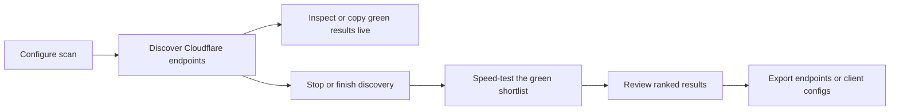

<p align="center">
  
</p>

<h1 align="center">KF Scanner</h1>

<p align="center">
  <strong>Find, validate, rank, and export resilient Cloudflare endpoints.</strong><br>
  One scanning engine. Three focused experiences for desktop, Android, and the terminal.
</p>

<p align="center">
  <a href="README.fa.md">فارسی</a> ·
  <a href="https://github.com/K_F_/KFScanner/releases/latest">Download</a> ·
  <a href="https://github.com/K_F_/KFScanner/issues">Report an issue</a>
</p>


---

KF Scanner is a cross-platform Cloudflare endpoint scanner for unstable, filtered, or high-latency networks. It performs fast edge probing, can validate the best candidates through your real proxy configuration with an embedded Xray core, and turns the results into client-ready exports.

Version **1.0.0** introduces the redesigned **Signal Desk** workflow across the desktop GUI and Android app, dedicated Results and Export workspaces, live copy actions, post-stop speed testing, opt-in neighbor scanning, and more resilient ISP detection.

## What makes it useful

| Capability | What it gives you |
|---|---|
| **Two-stage validation** | Fast Cloudflare reachability checks followed by optional end-to-end Xray tests |
| **Live results** | Search, sort, inspect, and copy healthy endpoints while a scan is still running |
| **Post-stop speed test** | Stop discovery when you have enough green results, then speed-test that exact shortlist |
| **Safe neighbor discovery** | Nearby Cloudflare addresses are explored only when you explicitly enable the option |
| **Proxy-aware probing** | SNI, host, path, transport, TLS, and port are derived from VLESS, Trojan, or VMess links |
| **Portable exports** | Raw endpoints, rewritten share URLs, subscription data, Sing-box JSON, and Clash YAML |
| **Resilient metadata** | ISP and ASN detection merges Cloudflare, IPWhois, and IPinfo, with Team Cymru DNS fallback |

## Choose your interface

| Interface | Platforms | Best for |
|---|---|---|
| **Desktop GUI** | Windows, Linux, macOS | Full Signal Desk experience, persistent sessions, live filtering, speed tests, and exports |
| **Android app** | Android 7.0+ | The same Scan / Results / Export flow with native Material 3 controls |
| **CLI / TUI** | Windows, Linux, macOS, Termux | Keyboard-first scanning, automation-friendly binaries, and low-overhead remote use |

## Signal Desk workflow



The desktop and Android interfaces keep each responsibility in its own workspace:

- **Scan** — configure source, ports, workers, timeout, WebSocket requirement, proxy URL, and the optional neighbor scan.
- **Results** — monitor progress, filter and sort endpoints, copy all green results or the top 20 at any time, then run the focused speed test after stopping.
- **Export** — copy raw endpoints or generate client-ready configurations after validation.

## Core features

### Discovery and ranking

- Weighted random sampling across embedded Cloudflare IPv4 ranges.
- File-based input in the desktop and CLI workflows, including IP, CSV, and CIDR entries.
- Multi-port probing with configurable worker count, timeout, and WebSocket checks.
- Live health, latency, loss, throughput, colo, port, and status reporting.
- Optional neighbor scanning in both GUI and CLI; it is **off by default**.
- Cancellation that preserves results already discovered.

### Validation and speed testing

- Supported share links: `vless://`, `trojan://`, and `vmess://`.
- Transport-aware parsing for TCP, WebSocket, gRPC, and XHTTP/SplitHTTP settings.
- Embedded Xray validation against the actual proxy configuration.
- Download throughput and TTFB measurement, with optional upload testing where configured.
- A dedicated speed-test action for the current healthy set after discovery stops.

### Copy and export

- Copy a single endpoint, every green endpoint, or the top 20 without waiting for discovery to finish.
- Copy validated `IP:port` endpoints.
- Rewrite the original share link for every passing endpoint.
- Generate a Base64 subscription, Sing-box JSON, and Clash YAML.
- Keep Results and Export separate, so exporting never interrupts result inspection.

## Download version 1.0.0

Download the build for your platform from [GitHub Releases](https://github.com/K_F_/KFScanner/releases/latest). The `v1.0.0` release workflow builds and publishes every supported interface together and adds `SHA256SUMS.txt`.

### Desktop GUI

| Platform | Release asset |
|---|---|
| Windows x64 | `KFScanner-1.0.0-gui-windows-amd64.zip` |
| Linux x64 | `KFScanner-1.0.0-gui-linux-amd64.tar.gz` |
| macOS Intel | `KFScanner-1.0.0-gui-macos-intel.zip` |
| macOS Apple Silicon | `KFScanner-1.0.0-gui-macos-apple-silicon.zip` |

The Windows executable and Android application use the transparent artwork from [`logo/logo.png`](logo/logo.png).

### CLI / TUI

| Platform | Release asset |
|---|---|
| Windows x64 | `KFScanner-1.0.0-cli-windows-amd64.exe` |
| Windows ARM64 | `KFScanner-1.0.0-cli-windows-arm64.exe` |
| Linux x64 | `KFScanner-1.0.0-cli-linux-amd64` |
| Linux ARM64 / Termux | `KFScanner-1.0.0-cli-linux-arm64` |
| macOS Intel | `KFScanner-1.0.0-cli-macos-intel` |
| macOS Apple Silicon | `KFScanner-1.0.0-cli-macos-apple-silicon` |

On Linux and macOS, make the downloaded CLI executable before running it:

```bash
chmod +x KFScanner-1.0.0-cli-*
./KFScanner-1.0.0-cli-linux-amd64
```

### Android

| Release asset | Device |
|---|---|
| `KFScanner-1.0.0-android-universal.apk` | Recommended sideload build for all supported ABIs |
| `KFScanner-1.0.0-android-arm64-v8a.apk` | Most current 64-bit Android devices |
| `KFScanner-1.0.0-android-armeabi-v7a.apk` | Older 32-bit ARM devices |

Android requires API 24 or newer. If you sideload an APK, Android may ask you to permit installation from the app that opened the file.

## Quick start

### Desktop or Android

1. Open **Scan** and keep the defaults for a first pass.
2. Add a VLESS, Trojan, or VMess URL if you want proxy-aware probing and client exports.
3. Enable **Neighbor scan** only if you want the wider search.
4. Start discovery and switch to **Results** whenever you want; the scan continues in the background.
5. Use **Copy green** or **Copy top 20** at any time.
6. Stop the scan when the shortlist is sufficient, then choose **Speed test green results**.
7. Open **Export** to copy raw endpoints or generate client configurations.

### CLI / TUI

```bash
kfscanner
kfscanner --version
```

Navigate with the arrow keys or `h` / `j` / `k` / `l`, confirm with `Enter`, go back with `Esc`, and stop an active scan with `q`. The TUI remembers the last scan configuration and exposes it through **Retry Last Scan**.

For file mode, place `ips.txt` next to the executable or in the current working directory. Accepted lines include a plain IPv4 address, the first field of a CSV line, or a CIDR. Blank lines and lines beginning with `#` are ignored.

### Termux

Use the Linux ARM64 CLI asset on modern phones:

```bash
pkg update
pkg install curl -y
curl -fL -o "$PREFIX/bin/kfscanner" \
  https://github.com/K_F_/KFScanner/releases/download/v1.0.0/KFScanner-1.0.0-cli-linux-arm64
chmod +x "$PREFIX/bin/kfscanner"
kfscanner
```

The native Android app is recommended if you prefer touch controls, system clipboard integration, and the full Signal Desk layout.

## Build from source

### Requirements

- Go **1.26.1** or the version declared in [`go.mod`](go.mod)
- Wails **2.11.0** plus the native webview dependencies for desktop GUI builds
- JDK **17**, Android SDK **36**, and Android Build Tools **36.0.0** for Android builds
- `gomobile` and `gobind` for rebuilding the Android Go bridge

### Test and build the CLI

```bash
go test -short ./...
go vet ./...
go build -trimpath -o kfscanner ./cmd/kfscanner
```

Windows can produce the versioned cross-platform CLI set with:

```powershell
./build.ps1 -Version 1.0.0
```

### Build the desktop GUI

Install Wails, then build from the `desktop` directory:

```powershell
go install github.com/wailsapp/wails/v2/cmd/wails@v2.11.0
cd desktop
./build_gui.ps1 -Version 1.0.0
```

Linux requires GTK 3 and WebKitGTK 4.1 development packages. macOS builds require the native Xcode toolchain. GitHub Actions builds each GUI on its target operating system rather than cross-compiling webviews.

### Build Android

```bash
# Linux / macOS
./android/build_go_mobile.sh
cd android
./gradlew testDebugUnitTest lintRelease assembleRelease
```

```powershell
# Windows
./android/build_go_mobile.bat
cd android
./gradlew.bat testDebugUnitTest lintRelease assembleRelease
```

Release APK signing uses these GitHub repository secrets:

- `ANDROID_KEYSTORE_BASE64`
- `ANDROID_KEYSTORE_PASSWORD`
- `ANDROID_KEY_ALIAS`
- `ANDROID_KEY_PASSWORD`

When they are absent, CI creates an ephemeral signing key for test artifacts. Those builds cannot update an application signed with a permanent production key.

## Release automation

The repository keeps platform builds separate and composes them in one final release:

| Workflow | Responsibility |
|---|---|
| [`ci.yml`](.github/workflows/ci.yml) | Cross-platform Go build, vet, test, race test, and lint |
| [`build-cli.yml`](.github/workflows/build-cli.yml) | Six versioned CLI targets |
| [`build-gui.yml`](.github/workflows/build-gui.yml) | Native Windows, Linux, Intel macOS, and Apple Silicon GUI packages |
| [`build-android.yml`](.github/workflows/build-android.yml) | Go mobile bridge, Android tests/lint, signed ABI APKs, and universal APK |
| [`release.yml`](.github/workflows/release.yml) | Publishes the complete **v1.0.0** release and SHA-256 checksums |

Pushing the exact tag `v1.0.0` starts the final release workflow.

## Repository map

```text
cmd/kfscanner/   CLI entry point
desktop/             Wails desktop backend and Signal Desk frontend
android/             Native Kotlin + Jetpack Compose application
mobile/              Go mobile bridge shared with Android
internal/            Scanner, probe, Xray, metadata, export, and TUI packages
logo/logo.png        Transparent source artwork
.github/workflows/   CI and release automation
```

## Security and responsible use

KF Scanner makes outbound network requests and may launch an embedded Xray process for local validation. Proxy share URLs often contain credentials: avoid posting them in issues, screenshots, logs, or exported samples. Scan only networks and address ranges you are authorized to test, and follow the rules that apply in your jurisdiction and on your network.

## Troubleshooting

- **No healthy results:** try a longer timeout, fewer workers, another port, or a different network. Leave neighbor scanning off until the baseline scan behaves predictably.
- **Phase 1 passes but speed validation fails:** verify the proxy URL, SNI/host, transport path, and upstream server in a known-working Xray client.
- **Clipboard fails in a terminal:** use the generated output file or copy from the desktop/Android Results workspace.
- **Android release will not update an installed build:** both APKs must be signed by the same key. Configure the permanent signing secrets before publishing production releases.
- **Need help:** open an issue with the app version, OS/architecture, interface, and reproducible steps—but remove proxy credentials first.

## Contributing

Issues and pull requests are welcome. Read [`CONTRIBUTING.md`](CONTRIBUTING.md) before making a larger change, and include tests for scanner, parser, export, or state-management behavior when practical.

## License

KF Scanner is available under the [MIT License](LICENSE).
